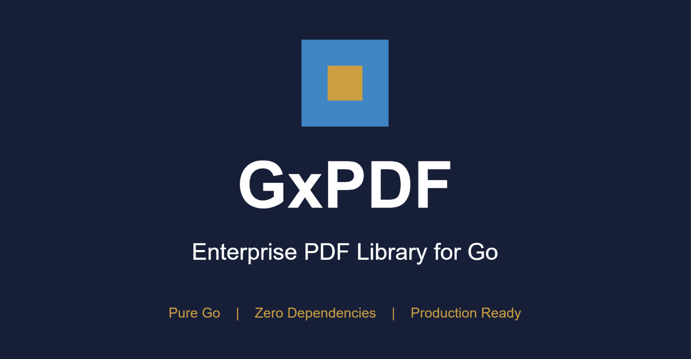

# GxPDF - Enterprise-Grade PDF Library for Go



[](https://go.dev/)
[](LICENSE)
[](https://github.com/coregx/gxpdf/actions/workflows/test.yml)
[](https://pkg.go.dev/github.com/coregx/gxpdf)
[](https://goreportcard.com/report/github.com/coregx/gxpdf)

**GxPDF** is a modern, high-performance PDF library for Go, built with clean architecture and Go 1.25+ best practices.

**[View Example PDF](assets/gxpdf_enterprise_brochure.pdf)** - See what GxPDF can create!

## Key Features

### PDF Creation (Creator API)
- **Text & Typography** - Rich text with multiple fonts, styles, and colors
- **Graphics** - Lines, rectangles, circles, polygons, ellipses, Bezier curves
- **Gradients** - Linear and radial gradient fills
- **Color Spaces** - RGB and CMYK support
- **Tables** - Complex tables with merged cells, borders, backgrounds
- **Images** - JPEG and PNG with transparency support
- **Fonts** - Standard 14 PDF fonts + TTF/OTF embedding with full Unicode support (Cyrillic, CJK, symbols)
- **Document Structure** - Chapters, auto-generated Table of Contents
- **Annotations** - Sticky notes, highlights, underlines, stamps
- **Interactive Forms** - Text fields, checkboxes, radio buttons, dropdowns
- **Security** - RC4 (40/128-bit) and AES (128/256-bit) encryption
- **Watermarks** - Text watermarks with rotation and opacity
- **Page Operations** - Merge, split, rotate, append

### PDF Reading & Extraction
- **Table Extraction** - Industry-leading accuracy (100% on bank statements)
- **Text Extraction** - Full text with positions and Unicode support
- **Image Extraction** - Extract embedded images
- **Export Formats** - CSV, JSON, Excel

## Installation

```bash
go get github.com/coregx/gxpdf
```

**Requirements**: Go 1.25 or later

## Quick Start

### Creating a PDF Document

```go
package main

import (
    "log"
    "github.com/coregx/gxpdf/creator"
)

func main() {
    c := creator.New()
    c.SetTitle("My Document")
    c.SetAuthor("GxPDF")

    page, _ := c.NewPage()

    // Add text
    page.AddText("Hello, GxPDF!", 100, 750, creator.HelveticaBold, 24)
    page.AddText("Professional PDF creation in Go", 100, 720, creator.Helvetica, 12)

    // Draw shapes
    page.DrawRectangle(100, 600, 200, 100, &creator.RectangleOptions{
        FillColor:   &creator.Blue,
        StrokeColor: &creator.Black,
        StrokeWidth: 2,
    })

    if err := c.WriteToFile("output.pdf"); err != nil {
        log.Fatal(err)
    }
}
```

### Unicode Text with Custom Fonts

```go
c := creator.New()
page, _ := c.NewPage()

// Load custom font with Unicode support
font, _ := c.LoadFont("/path/to/arial.ttf")

// Cyrillic text
page.AddTextCustomFont("Привет, мир!", 100, 700, font, 18)

// CJK text (requires appropriate font like Malgun Gothic)
cjkFont, _ := c.LoadFont("/path/to/malgun.ttf")
page.AddTextCustomFont("你好世界 • 안녕하세요", 100, 670, cjkFont, 16)

c.WriteToFile("unicode.pdf")
```

### Creating Encrypted PDFs

```go
c := creator.New()

c.SetEncryption(creator.EncryptionOptions{
    UserPassword:  "user123",
    OwnerPassword: "owner456",
    Permissions:   creator.PermissionPrint | creator.PermissionCopy,
    Algorithm:     creator.EncryptionAES256,
})

page, _ := c.NewPage()
page.AddText("This document is encrypted!", 100, 750, creator.Helvetica, 14)
c.WriteToFile("encrypted.pdf")
```

### Creating Documents with Chapters and TOC

```go
c := creator.New()
c.EnableTOC()

ch1 := creator.NewChapter("Introduction")
ch1.Add(creator.NewParagraph("Introduction content..."))

ch1_1 := ch1.NewSubChapter("Background")
ch1_1.Add(creator.NewParagraph("Background information..."))

ch2 := creator.NewChapter("Methods")
ch2.Add(creator.NewParagraph("Methods description..."))

c.AddChapter(ch1)
c.AddChapter(ch2)

c.WriteToFile("document_with_toc.pdf")
```

### Interactive Forms (AcroForm)

```go
import "github.com/coregx/gxpdf/creator/forms"

c := creator.New()
page, _ := c.NewPage()

// Text field
nameField := forms.NewTextField("name", 100, 700, 200, 20)
nameField.SetLabel("Full Name:")
nameField.SetRequired(true)
page.AddField(nameField)

// Checkbox
agreeBox := forms.NewCheckbox("agree", 100, 660, 15, 15)
agreeBox.SetLabel("I agree to the terms")
page.AddField(agreeBox)

// Dropdown
countryDropdown := forms.NewDropdown("country", 100, 620, 150, 20)
countryDropdown.AddOption("us", "United States")
countryDropdown.AddOption("uk", "United Kingdom")
page.AddField(countryDropdown)

c.WriteToFile("form.pdf")
```

### Reading and Filling Forms

```go
// Read form fields from existing PDF
doc, _ := gxpdf.Open("form.pdf")
defer doc.Close()

// Check if document has a form
if doc.HasForm() {
    fields, _ := doc.GetFormFields()
    for _, f := range fields {
        fmt.Printf("%s (%s): %v\n", f.Name(), f.Type(), f.Value())
    }
}

// Fill form fields
app, _ := creator.NewAppender("form.pdf")
defer app.Close()

app.SetFieldValue("name", "John Doe")
app.SetFieldValue("email", "john@example.com")
app.SetFieldValue("agree", true)  // Checkbox
app.SetFieldValue("country", "USA")  // Dropdown

app.WriteToFile("filled_form.pdf")
```

### Flattening Forms

```go
// Convert form fields to static content (non-editable)
app, _ := creator.NewAppender("filled_form.pdf")
defer app.Close()

app.FlattenForm()  // Flatten all fields
// Or: app.FlattenFields("signature", "date")  // Specific fields

app.WriteToFile("flattened.pdf")
```

### Extracting Tables from PDFs

```go
doc, _ := gxpdf.Open("bank_statement.pdf")
defer doc.Close()

tables := doc.ExtractTables()
for _, table := range tables {
    fmt.Printf("Table: %d rows x %d cols\n", table.RowCount(), table.ColumnCount())

    // Export to CSV
    csv, _ := table.ToCSV()
    fmt.Println(csv)
}
```

## Package Structure

```
github.com/coregx/gxpdf
├── gxpdf.go          # Main entry point
├── export/           # Export formats (CSV, JSON, Excel)
├── creator/          # PDF creation API
│   └── forms/        # Interactive form fields
└── internal/         # Private implementation
    ├── application/  # Use cases (extraction, reading)
    └── infrastructure/ # PDF parsing, encoding, writing
```

## Documentation

- **[API Reference](https://pkg.go.dev/github.com/coregx/gxpdf)** - Full API documentation
- **[Examples](examples/)** - Code examples for all features
- **[Enterprise Brochure (PDF)](assets/gxpdf_enterprise_brochure.pdf)** - Sample PDF created with GxPDF
- **[Architecture](docs/ARCHITECTURE.md)** - DDD architecture overview
- **[Contributing](CONTRIBUTING.md)** - Contribution guidelines
- **[Security](SECURITY.md)** - Security policy

## Testing

```bash
# Run all tests
go test ./...

# Run with race detector
go test -race ./...

# Run with coverage
go test -cover ./...
```

## Roadmap

### v0.1.x (Stable)
- [x] PDF reading and parsing (PDF 1.0-2.0)
- [x] Text extraction with positions
- [x] Table extraction (100% accuracy)
- [x] CSV/JSON/Excel export
- [x] Creator API (text, graphics, tables)
- [x] JPEG/PNG image support
- [x] TTF/OTF font embedding with full Unicode
- [x] RC4/AES encryption
- [x] Chapters and TOC
- [x] Annotations
- [x] Interactive forms (AcroForm)
- [x] Watermarks
- [x] Page operations (merge, split, rotate)

### v0.2.0 "Graphics Revolution" (In Development)

**Skia-like Graphics API** for [GoGPU/gg](https://github.com/gogpu/gg) integration:

- [x] Alpha channel / transparency (ExtGState)
- [x] Push/Pop graphics state stack
- [x] Fill/Stroke separation with Paint interface
- [x] Path Builder API (MoveTo, LineTo, CubicTo, etc.)
- [x] Linear and Radial gradients
- [x] ClipPath support

**Forms API** (Read, Fill, Flatten):

- [x] Form field reader (GetFormFields, GetFieldValue)
- [x] Form field writer (SetFieldValue with validation)
- [x] Form flattening (FlattenForm, FlattenFields)

**WASM/Platform Support**:

- [x] WASM API (WriteTo, Bytes for in-memory generation)

### v0.3.0+ (Planned)
- [ ] Digital signatures
- [ ] PDF/A compliance
- [ ] Object streams (30% compression)
- [ ] SVG import

## License

GxPDF is released under the **MIT License**. See [LICENSE](LICENSE) for details.

## Support

- **Issues**: [GitHub Issues](https://github.com/coregx/gxpdf/issues)
- **Discussions**: [GitHub Discussions](https://github.com/coregx/gxpdf/discussions)

---

**Built with Go 1.25+ and Domain-Driven Design**
